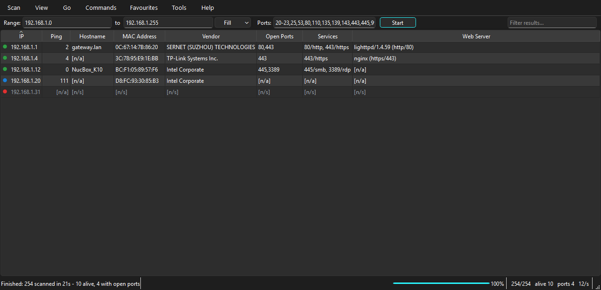

<div align="center">

# CyberCrew IP Scanner

**A fast, portable IP address and port scanner built for VAPT work.**

[](https://github.com/cybercrewinc/cybercrew-ip-scanner/actions/workflows/build.yml)
[](https://github.com/cybercrewinc/cybercrew-ip-scanner/actions/workflows/ci.yml)
[](LICENSE)
[](#download)

Scan any range. Find every live host. Know what is listening on it.

</div>



---

## What it does

CyberCrew IP Scanner sweeps an address range, works out which hosts are alive,
and then tells you as much as it can about each one: hostname, MAC address and
hardware vendor, open TCP ports, the services and version banners behind them,
NetBIOS identity, web server details and TLS certificates.

It is a **single portable file**. No installer, no runtime to deploy, no
registry keys. Copy it to a USB stick, run it on a client site, delete it when
you leave.

Everything is built around one idea: on a real engagement you are usually
looking at a subnet you have never seen before, and the first thing you need is
an accurate picture of what is on it.

### Why it finds more than a plain ping sweep

Most scanners send an ICMP echo and call anything that stays quiet "dead".
Windows Firewall blocks ICMP by default, so that approach silently misses a
large share of a typical corporate estate.

This scanner escalates instead:

1. **ICMP echo** — fast, and enough for most devices.
2. **ARP** — for anything on a directly attached subnet. A host cannot refuse
   an ARP request without dropping off the network entirely, so this catches
   machines that ignore ping.
3. **TCP probe** — against common ports. A refused connection (`RST`) proves
   the host exists just as well as an accepted one does.

The practical result is that firewalled Windows hosts show up as alive rather
than being quietly skipped.

---

## Download

Grab the build for your platform from the
[**latest release**](https://github.com/cybercrewinc/cybercrew-ip-scanner/releases/latest) —
unzip it and run it.

| Platform | File | Notes |
|---|---|---|
| Windows x64 | `CyberCrewIPScanner-windows-x64.zip` | Double-click the `.exe` |
| Linux x64 | `CyberCrewIPScanner-linux-x64.zip` | `chmod +x CyberCrewIPScanner` first |
| macOS Intel | `CyberCrewIPScanner-macos-x64.zip` | Unsigned: right-click → **Open** |
| macOS Apple Silicon | `CyberCrewIPScanner-macos-arm64.zip` | Unsigned: right-click → **Open** |

No administrator or root rights are needed. On Windows the scanner uses the
system ICMP helper API rather than raw sockets, so a normal user account is
enough.

> The archive contains a `portable.txt` marker. Leave it in place and settings
> live next to the executable; delete it and they move to your user profile.

---

## Quick start

### The window

1. Launch it. The range boxes are pre-filled with the subnet you are on.
2. Adjust the ports if you want something other than the defaults.
3. Press **Start** (or `F5`).

Results stream in live. Each row carries a coloured dot: green means open
ports were found, blue means the host answered, red means it did not.

Use **View** to switch between showing alive hosts, hosts with open ports, or
everything. That filter applies to results already on screen, so you can change
your mind after a scan without running it again.

### The command line

The same binary is a full CLI when you give it arguments.

```bash
# Sweep a subnet
CyberCrewIPScanner 192.168.1.0/24

# Specific range, specific ports, HTML report out
CyberCrewIPScanner 10.0.0.1-10.0.0.50 -p 22,80,443,8080 -o engagement.html

# Whatever subnet this machine is on, full service detail
CyberCrewIPScanner --local -p 1-1024 --fetchers ip,ping,hostname,ports,services,banner

# Feed a target list, emit ip:port pairs for the next tool in the chain
CyberCrewIPScanner --file targets.txt -o found.lst --format lst
```

Run `CyberCrewIPScanner --help` for everything, or `--list-fetchers` to see the
available columns.

---

## What it can gather

Each column is a **fetcher** — an independent probe you switch on or off under
**Tools → Select fetchers**. Turning off what you do not need makes scans
faster.

| Fetcher | Column | What you get |
|---|---|---|
| `ip` | IP | The address (always present) |
| `ping` | Ping | Round-trip time in ms |
| `ttl` | TTL | Reply TTL |
| `osguess` | OS Guess | OS family and hop count inferred from TTL |
| `loss` | Loss % | Percentage of probes unanswered |
| `hostname` | Hostname | Reverse DNS |
| `mac` | MAC Address | Layer-2 address (same subnet only) |
| `vendor` | Vendor | Manufacturer, with hypervisor and SBC hints |
| `ports` | Open Ports | TCP ports accepting connections |
| `filtered` | Filtered Ports | Ports dropped without a reply |
| `services` | Services | Likely service per open port |
| `banner` | Banners | Version strings — the input to a CVE lookup |
| `http` | Web Server | `Server` header of any HTTP(S) service |
| `http_title` | Page Title | HTML `<title>` of the served page |
| `tls` | TLS Certificate | Subject CN and expiry, expired certs flagged |
| `netbios` | NetBIOS Name | Computer name |
| `netbios_group` | Workgroup | Workgroup or domain |
| `netbios_user` | Logged-in User | Currently logged-on user, where advertised |
| `comment` | Comment | Your own note, saved between sessions |

### Vendor identification

A 40,000-entry IEEE registry ships inside the binary, so vendor lookup works
with no network access.

Where the registered owner is not the useful answer, the hint is added
alongside it — `08:00:27` reports as **PCS Systemtechnik GmbH (VirtualBox)**,
because on an engagement what matters is that you are looking at a VM. VMware,
Hyper-V, QEMU/KVM, Xen, Parallels, Docker and Raspberry Pi are all identified
this way. Randomised (locally administered) MACs are labelled as such rather
than reported as unknown.

Refresh the registry any time with **Tools → Update MAC vendor database**.

---

## Exporting

**Scan → Export results** (`Ctrl+S`), or `-o` on the command line. Format is
taken from the file extension.

| Format | Extension | Use it for |
|---|---|---|
| CSV | `.csv` | Spreadsheets, further processing |
| Text | `.txt` | Aligned columns, readable as-is |
| XML | `.xml` | Structured import |
| JSON | `.json` | Scripting and automation |
| IP:Port list | `.lst` | Feeding the next tool in a chain |
| HTML report | `.html` | A self-contained deliverable |

The HTML report embeds all of its own styling, contains no scripts and makes no
external requests, so it opens correctly on a machine with no internet and
survives being emailed as an attachment.

---

## Tuning

**Tools → Preferences**.

- **Maximum threads** (default 100) — the main speed control. Raise it on a
  fast local network; lower it on a congested link or where you might trip
  rate limiting.
- **Delay between hosts** — set this above zero to scan more quietly.
- **Liveness probe** — leave on *Combined* unless you specifically want a
  single method.
- **Ports in parallel** (default 128) — a whole batch of connections is opened
  at once and waited on together, so scanning 128 ports costs about as much
  time as scanning one.
- **Report filtered ports** — off by default. Telling a dropped packet from a
  closed one means waiting out the full timeout on every silent port, which is
  slow. Turn it on when the distinction matters.

As a reference point, a full `/24` with ping, reverse DNS, MAC, vendor, port
scan and NetBIOS completes in roughly 20 seconds on a normal LAN.

---

## Building from source

Requires Python 3.9 or newer.

```bash
git clone https://github.com/cybercrewinc/cybercrew-ip-scanner.git
cd cybercrew-ip-scanner
pip install -r requirements.txt

python main.py                    # window
python main.py 192.168.1.0/24     # CLI
python -m pytest tests            # tests
```

To produce a portable binary for the platform you are on:

```bash
pip install pyinstaller pillow
python build.py --clean
```

The result lands in `dist/`, zipped and ready to publish. Binaries for all
platforms are built automatically on tagged releases.

> The scanning engine itself is pure standard library. PyQt6 is needed only for
> the window, and psutil only for interface discovery — the CLI runs happily
> without either where it has to.

---

## Extending it

A fetcher is one class. Drop this in and it becomes a column, an export field
and a CLI option automatically:

```python
from ipscanner.fetchers.base import Fetcher, register

@register
class SSHVersionFetcher(Fetcher):
    id = "ssh_version"
    name = "SSH Version"
    description = "Version string from port 22."
    order = 45              # fetchers run in ascending order
    requires_alive = True   # skipped on hosts that did not answer

    def scan(self, subject):
        if 22 not in (subject.get("open_ports") or []):
            return None
        from ipscanner.core.portscan import grab_banner
        return grab_banner(subject.ip, subject.family, 22, 2.0) or None
```

Fetchers share a per-host scratchpad, so a later one can reuse earlier work
instead of re-probing — which is why the example above can just read
`open_ports` rather than scanning again.

---

## Authorised use only

This tool is built for security professionals doing authorised work.

Port scanning a network you do not own or have written permission to test is
illegal in most jurisdictions. Get your authorisation in writing, keep it in
scope, and keep a copy of it. What you do with this software is your
responsibility.

---

## License

MIT — see [LICENSE](LICENSE). Built and maintained by **CyberCrew**.
